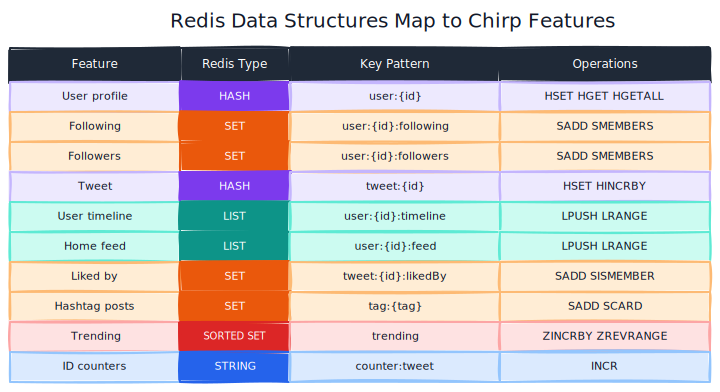
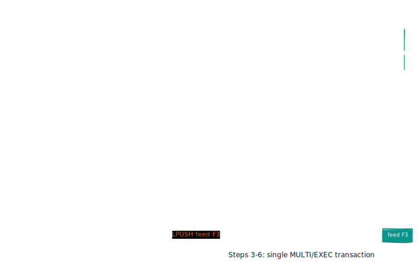
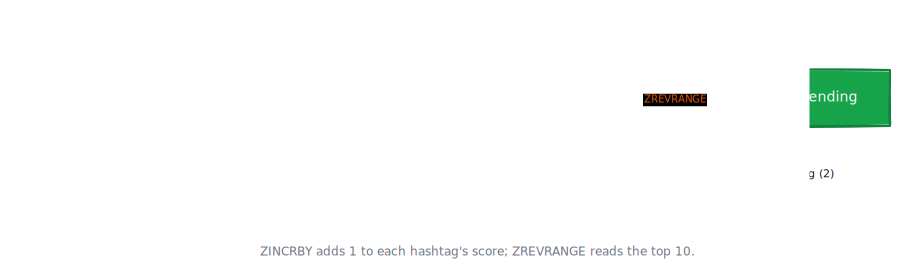

# Chirp

A Redis-backed mini Twitter that maps social-feed features onto Redis data structures, built with Java 17, Jedis 5, and Docker Compose.

## Overview

Chirp is a small social-feed application designed to show how Redis primitives
model real product features. User profiles are HASHes, the follow graph is
built from SETs, timelines and feeds are LISTs, and the trending leaderboard
is a SORTED SET. The home feed uses fan-out-on-write: when a user posts, the
tweet id is pushed into every follower's feed inside a single transaction, so
reading a feed is one `LRANGE` call with flat latency.

The interface is a command-line client. There is no REST API; the focus is on
the data model and the Redis operations behind each feature.

## Features

- Register users with a username, display name, and bio
- Follow and unfollow other users
- Post tweets with hashtag extraction
- Home feed via fan-out-on-write (one `LRANGE` per read)
- Per-user timeline and a global timeline
- Likes with duplicate prevention (`HINCRBY` plus a `likedBy` SET)
- Hashtag trending leaderboard backed by a sorted set
- One-command demo data seeding

## Tech Stack

| Layer    | Technology              |
|----------|-------------------------|
| Language | Java 17                 |
| Build    | Maven                   |
| Redis    | Redis 7 (Docker Compose)|
| Client   | Jedis 5.x               |
| Packaging| maven-shade-plugin      |

## Architecture


The CLI calls into service classes that own each feature area. Every service
borrows a connection from a shared `JedisPool`, runs its Redis commands, and
returns the connection in a try-with-resources block. No service holds a
connection across user input.

## How Redis Structures Map to Features



| Feature       | Redis Type   | Key Pattern            | Operations              |
|---------------|--------------|------------------------|-------------------------|
| User profile  | HASH         | `user:{id}`            | HSET, HGET, HGETALL     |
| Following     | SET          | `user:{id}:following`  | SADD, SMEMBERS          |
| Followers     | SET          | `user:{id}:followers`  | SADD, SMEMBERS          |
| Tweet         | HASH         | `tweet:{id}`           | HSET, HINCRBY           |
| User timeline | LIST         | `user:{id}:timeline`   | LPUSH, LRANGE           |
| Home feed     | LIST         | `user:{id}:feed`       | LPUSH, LRANGE           |
| Liked by      | SET          | `tweet:{id}:likedBy`   | SADD, SISMEMBER         |
| Hashtag posts | SET          | `tag:{tag}`            | SADD, SCARD             |
| Trending      | SORTED SET   | `trending`             | ZINCRBY, ZREVRANGE      |
| ID counters   | STRING       | `counter:tweet`        | INCR                    |

## Getting Started

### Prerequisites

- Java 17 or later
- Maven 3.8+
- Docker (for Redis)

### Start Redis

```bash
docker compose up -d
```

Redis is now available on `localhost:6379`. To point the app at a different
host or port, set `REDIS_HOST` and `REDIS_PORT` environment variables.

### Build

```bash
mvn clean package
```

This produces a shaded jar at `target/chirp-1.0.0.jar` with the CLI as the
main class.

### Run

```bash
java -jar target/chirp-1.0.0.jar
```

## Usage

Start the CLI and pick option 8 to seed demo data on first run:

```
=== Chirp ===
A Redis-backed mini Twitter.

1. Register
2. Follow
3. Post
4. Show home feed
5. Show user timeline
6. Like
7. Show trending
8. Seed demo data
9. Quit
> 8
Demo data loaded: 5 users, follow graph, tweets, and likes.
```

View a home feed (user 2 follows user 1, so Ada's tweets appear):

```
> 4
Your user id: 2
--- Home feed for user 2 ---
[1] @ada  2025-01-15 14:30
    The analytical engine weaves algebraic patterns just like the Jacquard loom. #history #computing
    2 likes

[2] @alan  2025-01-15 14:31
    A computer would deserve to be called intelligent if it could deceive a human. #ai #computing
    3 likes
```

Check trending hashtags:

```
> 7
--- Trending hashtags ---
 1. #programming          3 posts
 2. #computing            2 posts
 3. #ai                   2 posts
 4. #unix                 1 posts
 5. #opensource           1 posts
```

Post a new tweet:

```
> 3
Your user id: 1
Text: Fan-out-on-write keeps reads fast. #redis #architecture
Posted: [#8] @ada: Fan-out-on-write keeps reads fast. #redis #architecture (0 likes)
```

## Fan-Out Design



When a user posts, Chirp writes the tweet HASH, then pushes the tweet id onto
three places inside one Redis transaction:

1. The author's own timeline (`user:{id}:timeline`)
2. The global timeline (`global:timeline`)
3. The author's own feed and every follower's feed (`user:{fid}:feed`)

This is fan-out-on-write. The work happens at write time so that reads are
trivial: a home feed is a single `LRANGE` on the user's feed LIST, regardless
of how many people they follow. The tradeoff is extra writes per post
proportional to follower count, which is fine for a read-heavy social feed
where most users have a modest audience.

## Trending



Every hashtag in a tweet is extracted with a regex and scored in the
`trending` sorted set. Each occurrence calls `ZINCRBY trending 1 {tag}`,
which atomically increments the tag's score. The leaderboard is read with
`ZREVRANGE trending 0 9 WITHSCORES`, which returns the top 10 tags ranked by
score in descending order. A separate SET per tag (`tag:{tag}`) tracks which
tweet ids use that hashtag.

## Project Structure

```
redis-chirp/
  docker-compose.yml
  pom.xml
  src/main/java/com/chirp/
    ChirpCli.java                 CLI entry point and menu loop
    model/
      User.java                   User profile model
      Tweet.java                  Tweet model
    service/
      UserService.java            Registration, follow graph (HASH, SET)
      TimelineService.java        Posting, timelines, fan-out (HASH, LIST)
      FeedService.java            Home feed reads (LIST)
      LikeService.java            Likes and unlike (HASH, SET)
      TrendingService.java        Hashtag leaderboard (SORTED SET)
    seed/
      SeedData.java               Demo data loader
    util/
      RedisConfig.java            JedisPool from env vars
      Keys.java                   Central key-pattern definitions
  docs/diagrams/
    architecture.svg              System architecture
    data-structures.svg           Feature-to-Redis-type map
    fanout.svg                    Fan-out-on-write sequence
    trending.svg                  Hashtag trending pipeline
```

## License

MIT. See [LICENSE](LICENSE).
